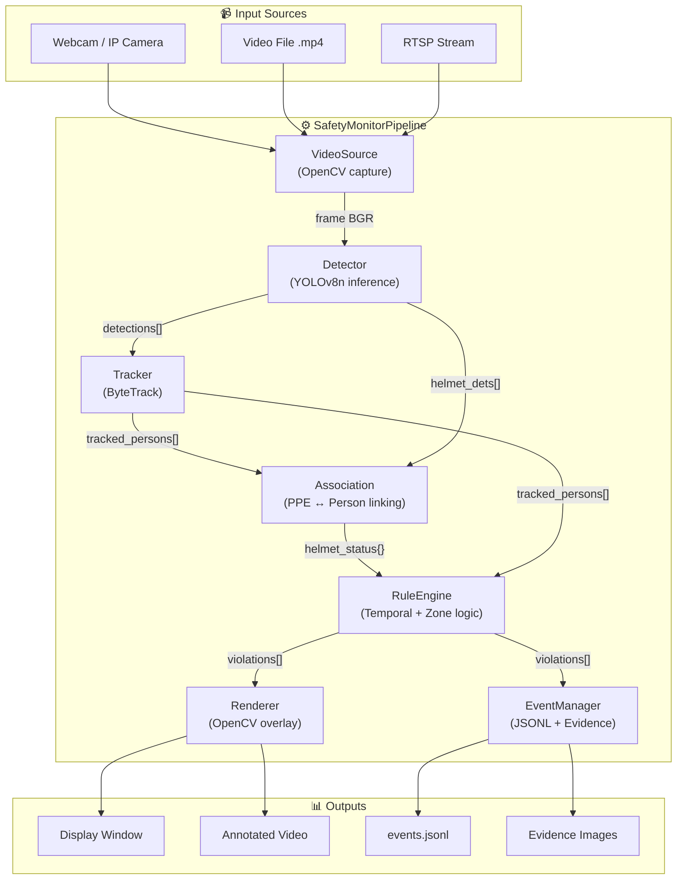
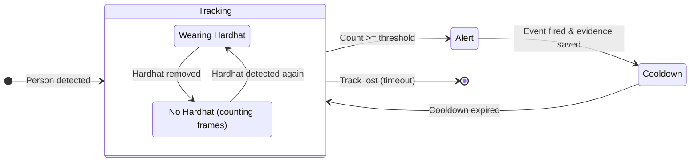
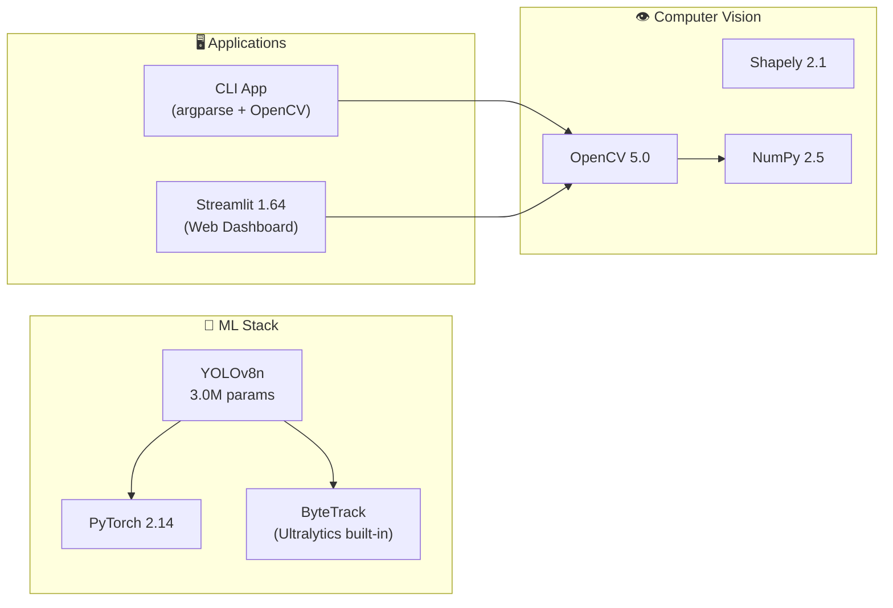

<div align="center">
  <h1>🦺 Vision Safety Monitor</h1>
  <p><b>Real-Time Safety Helmet Compliance & Restricted-Zone Monitoring System powered by AI.</b></p>
  
  [](#)
  [](#)
  [](#)
  [](#)
  [](#)
  [](#)
</div>

---

## Overview

**Vision Safety Monitor** is an AI-powered video analytics system that detects safety violations — specifically **workers not wearing hard hats** and **unauthorized zone intrusions** — in real-time from camera feeds or recorded video.

### Core Objectives
- Detect and classify **Hardhat**, **NO-Hardhat**, and **Person** in construction site footage using a fine-tuned YOLOv8n model.
- Track individuals across frames with **ByteTrack** to maintain persistent identity (no duplicate alerts).
- Apply **temporal persistence filtering** to eliminate false positives (only alert after N consecutive violation frames).
- Automatically capture **evidence screenshots** and log all events to a structured JSONL audit trail.

---

## Screenshots

<div align="center">
  <i>📹 Live detection & tracking with annotated bounding boxes</i>
  <br><br>
  <i>🖥️ Streamlit Web Dashboard with video source selection</i>
  <br><br>
  <i>📊 Evaluation metrics and benchmark results</i>
</div>

---

## Key Features

| Feature | Description |
| :--- | :--- |
| **Helmet Detection** | Fine-tuned YOLOv8n model detecting Hardhat, NO-Hardhat, and Person classes with **mAP@50 = 0.789**. |
| **Restricted Zone Monitoring** | Polygon-based geofencing with Shapely — triggers alerts when workers enter forbidden areas. |
| **Real-time Object Tracking** | ByteTrack integration maintains stable person IDs across frames, preventing duplicate violations. |
| **Temporal Persistence Filter** | Configurable frame threshold before raising alerts — eliminates flicker from single-frame misdetections. |
| **Evidence Capture** | Automatic screenshot capture with annotated overlays when violations are confirmed. |
| **Event Logging** | Structured JSONL audit trail with timestamps, track IDs, violation types, and confidence scores. |
| **Dual Interface** | CLI app (OpenCV window) for low-latency monitoring + Streamlit web dashboard for browser-based analysis. |
| **Sample Video Selection** | Built-in dropdown with 3 pre-loaded construction site videos — no file upload required for demo. |

---

## Model Performance

### Evaluation Results (50 Epochs)

| Class | AP@50 | Precision | Recall |
| :---: | :---: | :---: | :---: |
| Hardhat | 0.875 | 0.931 | 0.785 |
| NO-Hardhat | 0.682 | 0.910 | 0.609 |
| Person | 0.811 | 0.835 | 0.723 |
| **Overall** | **0.789** | **0.892** | **0.705** |

### Inference Benchmark

| Metric | Value |
| :--- | :--- |
| **Architecture** | YOLOv8n (3.0M params, 8.1 GFLOPs) |
| **Inference Speed** | ~60.5 FPS (CPU, Apple M3) |
| **Latency** | 16.54ms / frame |
| **Memory** | ~443 MB |
| **Input Size** | 640×640 |

---

## System Architecture



---

## Processing Pipeline

Each frame is processed through a 7-step pipeline running at **~60 FPS**:

1. **Capture** — Read a frame from the video source (camera, file, or RTSP).
2. **Detect** — YOLOv8n scans the frame, identifying all Persons, Hardhats, and NO-Hardhats.
3. **Track** — ByteTrack matches detections to existing tracks, assigning stable IDs.
4. **Associate** — IoU + vertical position matching links helmets to their respective persons.
5. **Evaluate Rules** — RuleEngine checks zone containment (Shapely) and temporal persistence thresholds.
6. **Record Events** — EventManager writes JSONL logs and saves evidence screenshots for confirmed violations.
7. **Render** — Annotated frame with bounding boxes, zone overlays, alerts, and FPS counter is displayed.

---

## State Machine — Per-Person Tracking



---

## Technology Stack



---

## Project Structure

```
vision-safety-monitor/
├── src/safety_monitor/        # Core modules
│   ├── config.py              #   YAML config + dataclasses
│   ├── schemas.py             #   Data types (Detection, Event, etc.)
│   ├── video_source.py        #   Video/webcam input adapter
│   ├── detector.py            #   YOLOv8 inference wrapper
│   ├── tracker.py             #   ByteTrack person tracking
│   ├── association.py         #   Helmet ↔ Person linking (IoU)
│   ├── rules.py               #   Temporal persistence + zone logic
│   ├── events.py              #   JSONL recorder + evidence capture
│   ├── renderer.py            #   OpenCV visualization overlay
│   └── pipeline.py            #   Orchestrator (main entry point)
│
├── apps/                      # Demo applications
│   ├── cli.py                 #   CLI with OpenCV display
│   └── streamlit_app.py       #   Web dashboard
│
├── scripts/                   # Utilities
│   ├── inspect_dataset.py     #   Dataset inventory
│   ├── prepare_dataset.py     #   3-class MVP subset preparation
│   ├── train.py               #   YOLO training (smoke/full)
│   ├── evaluate.py            #   Model evaluation
│   ├── benchmark.py           #   FPS/latency benchmark
│   └── export_model.py        #   ONNX/TensorRT export
│
├── tests/                     # Unit tests (30 tests)
│   ├── test_dataset_validation.py
│   ├── test_zone_rules.py
│   ├── test_temporal_rules.py
│   └── test_event_deduplication.py
│
├── configs/                   # Configuration
│   ├── app.yaml               #   Main app config
│   └── zones.example.json     #   Zone polygon examples
│
├── models/                    # Model weights (git-ignored)
├── data/                      # Dataset (git-ignored)
├── artifacts/                 # Runtime outputs (git-ignored)
└── reports/                   # Evaluation & benchmark reports
```

---

## Getting Started

### 1. Prerequisites
- **Python 3.12+**
- **pip** (package manager)

### 2. Installation
```bash
# Clone the repository
git clone https://github.com/MrPhuocTan/vision-safety-monitor.git
cd vision-safety-monitor

# Create virtual environment
python -m venv venv
source venv/bin/activate  # macOS/Linux

# Install dependencies
pip install -r requirements.txt
```

### 3. Download Model Weights
Download the trained `best.pt` weights and place them in the `models/` directory:
```bash
mkdir -p models
# Copy your trained weights
cp /path/to/your/best.pt models/best.pt
```

### 4. Run Demo

**Option A: CLI (OpenCV Window)**
```bash
# Run with a sample video
python -m apps.cli --source dataset/source_files/source_files/hardhat.mp4 --save-output

# Run with webcam
python -m apps.cli --source 0
```

**Option B: Web Dashboard (Streamlit)**
```bash
streamlit run apps/streamlit_app.py
```
The dashboard opens at `http://localhost:8501` with a built-in video selector dropdown.

### 5. Train Your Own Model
```bash
# Prepare 3-class MVP dataset
python scripts/prepare_dataset.py

# Smoke test (2 epochs)
python scripts/train.py --mode smoke --epochs 2

# Full training (50 epochs)
python scripts/train.py --mode full --epochs 50 --batch 8
```

### 6. Evaluate & Benchmark
```bash
# Evaluate model on validation set
python scripts/evaluate.py

# Run FPS benchmark
python scripts/benchmark.py --video dataset/source_files/source_files/hardhat.mp4
```

---

## Configuration

All settings are managed in `configs/app.yaml`:

| Section | Key Parameters |
| :--- | :--- |
| **Model** | `weights`, `device` (cpu/cuda/mps), `conf_threshold`, `imgsz` |
| **Classes** | Target class IDs and names (Hardhat=0, NO-Hardhat=2, Person=5) |
| **Tracker** | ByteTrack thresholds, track buffer, match threshold |
| **Rules** | `helmet_persistence_frames`, `zone_persistence_frames`, `alert_cooldown_seconds` |
| **Zones** | Normalized polygon coordinates for restricted areas |
| **Output** | Evidence directory, video codec, events JSONL path |

---

## Dataset

This project uses the **Construction Site Safety (CSS) Dataset** with 2,801 annotated images.

| Split | Images | Ratio |
| :---: | :---: | :---: |
| Train | 2,605 | ~90% |
| Validation | 114 | ~5% |
| Test | 82 | ~5% |

**Classes (MVP 3-class subset):** Hardhat, NO-Hardhat, Person  
*(Mapped from the original 10-class dataset to focus on the core safety detection task)*

---

## Support & Contact

For technical inquiries or collaboration opportunities:

**Author:** MrPhuocTan — phtan.working@gmail.com

*Vision Safety Monitor — © 2026 MrPhuocTan. All rights reserved.*
